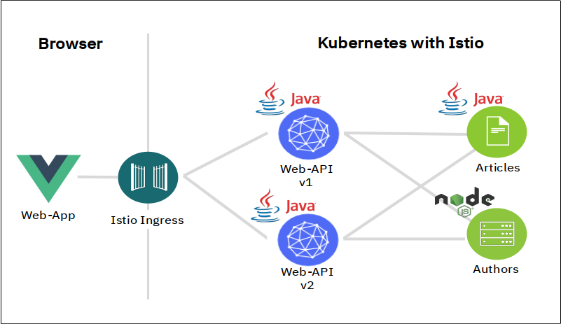

# Istio Hands-On

Do you need to select the right technologies to build your next application? Learn how Kubernetes and Istio give you full control over your microservices. 

Kubernetes minimizes outages and disruptions through self-healing, intelligent scheduling, horizontal scaling, and load balancing. 

[Istio](https://www.ibm.com/cloud/info/istio) is an open platform to connect, secure, control and observe microservices, also known as a service mesh, on cloud platforms such as Kubernetes. With Istio, you can manage network traffic, load balance across microservices, enforce access policies, verify service identity, secure service communication, and observe exactly what is going on with your services.

In this workshop, you can see how to install and use Istio alongside microservices for a simple app called [Cloud Native Starter](https://github.com/IBM/cloud-native-starter). 

## Objectives

After you complete this workshop, you'll be able to:
- Install Istio in your cluster
- Deploy the Cloud Native Starter sample
- Use metrics, logging, and tracing to observe services
- Perform simple traffic management, such as A/B tests and canary deployments, and fault injection
- Apply mTLS to your Service Mesh and secure access to services

## Get Started

These are the exercises of this workshop, go through all of them in sequence, start with Exercise 1:

- [Exercise 1: Create your Cloud environment](workshop/exercise1.md)
- [*Exercise 2: Setup your work environment*](workshop/exercise2.md)
- [*Exercise 3: Install the Cloud Native Starter sample app*](workshop/exercise3.md)
- [*Exercise 4: Telemetry*](workshop/exercise4.md)
- [*Exercise 5: Traffic Management*](workshop/exercise5.md)
- [*Exercise 6: Secure your services*](workshop/exercise6.md)

---

The [presentation](Istio-Hands-On.pdf) that goes together with this workshop is in the root if this Github repository.

## Credits

This workshop is based on the [Istio101](https://github.com/IBM/istio101) workshop in the IBM Github repo.
Contributors to this Istio101 workshop are [Lin Sun](https://github.com/linsun), [Belinda Vennam](https://github.com/beemarie), and many [more](https://github.com/IBM/istio101/graphs/contributors).