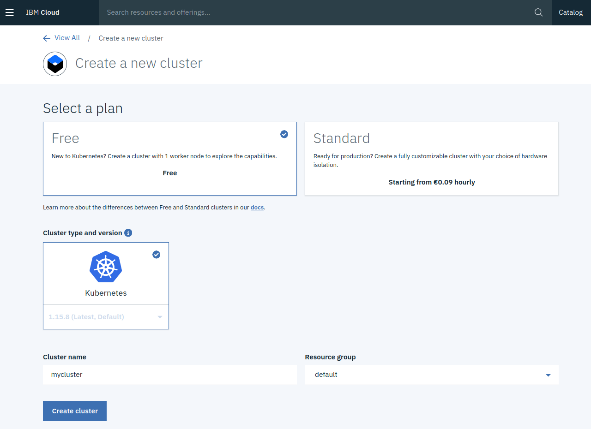

Content:
**Exercise 1: Create your Cloud environment** ##
[Exercise 2: Setup your work environment](exercise2.md) ##
[Exercise 3: Install the Cloud Native Starter sample app](exercise3.md) ##
[Exercise 4: Telemetry](exercise4.md) ##
[Exercise 5: Traffic Management](exercise5.md)

---

# Exercise 1: Create your Cloud environment

---

## Create an IBM Cloud Account

We will use a (free) Kubernetes cluster on the IBM Cloud for this workshop. So you need an IBM Cloud Account:

1. Register at [https://ibm.biz/developer-dach](https://ibm.biz/developer-dach).
    We need your email address, your name, your country, and a password. Registration is free and without any obligations.

1. Once you registered, check the email account used during registration for a confirmation mail. Click on the link within.

1. Logon to the [IBM Cloud](https://cloud.ibm.com).

1. You should have received a card with a code from your lab instructor. 
    - In the IBM Cloud dashboard, in the top menu, pull down "Manage", select "Account".
    - On the left side, select "Account Settings".
    - Scroll down to "Subscription and feature codes".
    - Click "Apply code" and enter the code from the card.

    You can find more detailed instructions at [https://ibm.biz/cloudcodes](https://ibm.biz/cloudcodes).

    This will allow you to create a free Kubernetes cluster.

---

## Create a Kubernetes cluster with IBM Kubernetes Service

To create a Kubernetes cluster, follow these steps:

1. In the IBM Cloud dashboard, open the burger menu (upper left corner).

1. Select "Kubernetes".

1. In the "Clusters" menu, click on "Create cluster".

1. Select the "Free" plan.

1. Cluster type an version is "Kubernetes".

1. If you want, change the clsuter name but "mycluster" is fine.

1. Leave "default" for the Resource group.

1. Click "Create cluster"

   

Creation of the clsuter will take some 15 minutes (typically). Please tell your lab instructor that you have started cluster creation.

---

## >> [Continue with Exercise 2](exercise2.md)