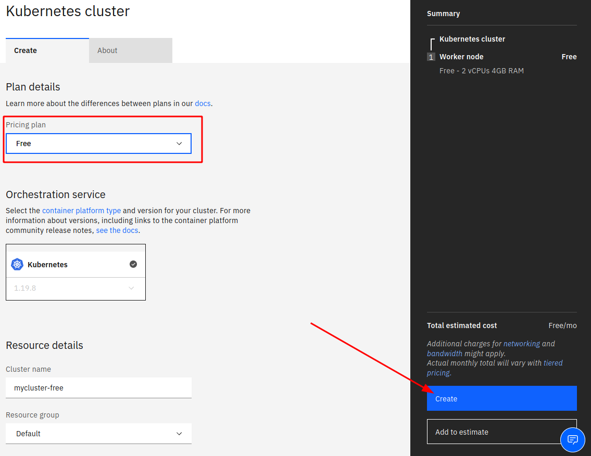

# Exercise 1: Create your Cloud environment

## 1. Create an IBM Cloud Account

You need an IBM Cloud Account and an IBM Cloud Feature Code:

1. You can register at [https://cloud.ibm.com](https://cloud.ibm.com).

    We need your email address, a password, your name, and your country. 
    
    During the registration, we will send a verification code to your email address that you have to enter into the registration form. 
    
    Registration is free and without any obligations.

1. With your new account logon to the IBM Cloud Dashboard [https://cloud.ibm.com](https://cloud.ibm.com).

1. In the IBM Cloud dashboard, click on "Manage", then "Account":

    

1. In "Account Settings", click "Apply code" and enter your Feature Code, then click "Apply":

    

## 2. Create a Kubernetes cluster

In this step you will create a "Lite" Kubernetes cluster. 

1. Click on the "hamburger" menu icon (4 horizontal lines) in the upper left corner of the dashboard.
2. Click on "Kubernetes".
3. Click on "Create a cluster +"

    

4. Select "Pricing Plan: Free", leave the defaults for the other fields. Click "Create"

    

Creating a new Kubernetes cluster will take 15 to 20 minutes.

## 3. Check if your cluster is ready

You will see a kind of progress bar in the Clusters page while the cluster is being deployed:

When the green "Normal" indicator shows, click on "Overview":

Notice the 30 day expiration warning: "Lite" (free, no charge) clusters are automatically deleted after 30 days.

"Version" is the Kubernetes version, e.g. 1.19.8 Build 1538

"Zone" is the geographical location of the cluster, "mil01" is one of the IBM datacenters in Milan, Italy.  You can find a list of datacenters and their corresponding codes [here](https://cloud.ibm.com/docs/overview?topic=overview-locations#data-centers){:target="_blank"}.

---

## >> [Continue with Exercise 2](exercise2.md)
