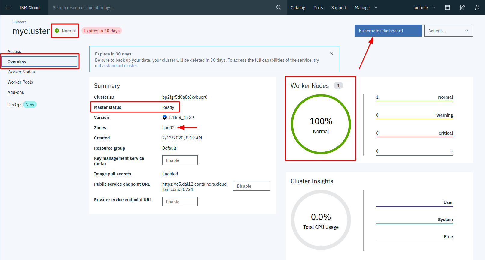
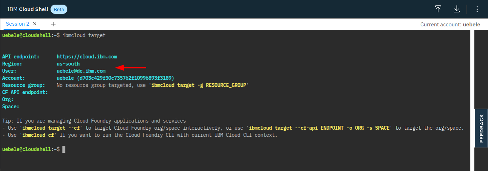

Content:
[Exercise 1: Create your Cloud environment](exercise1.md) ##
**Exercise 2: Setup your work environment** ##
[Exercise 3: Install the Cloud Native Starter sample app](exercise3.md) ##
[Exercise 4: Telemetry](exercise4.md) ##
[Exercise 5: Traffic Management](exercise5.md) ##
[Exercise 6: Secure your services](exercise6.md)

---

# Exercise 2: Setup your work environment

---

## Check if the cluster is ready

In the IBM Cloud dashboard, in the "Clusters" menu, go to the "Overview" tab of your cluster:



You should see:
- Status: Normal (and green)
- Master status: Ready
- Worker Nodes: 100 % Normal

The overview also shows where the cluster was created (in coded form, see table [Single zones for classic clusters](https://cloud.ibm.com/docs/containers?topic=containers-regions-and-zones#zones) for a list): "hou02" is Houston, Tx. The free clusters are generated whereever spare capacity is available.

Click on "Kubernetes dashboard" and have a look around.

---

## IBM Cloud Shell

You will use the IBM Cloud Shell to continue with the workshop. It is a web based Linux shell that has all the required tools installed and has you already logged into your IBM Cloud account. It is currently beta but has been used in many workshops.

1. In the menu bar of the IBM Cloud dashboard click on the "terminal" icon:
    

1. Wait a moment for the environment being created:

    

    Read the **Note** displayed in the shell about limits and timeouts!

    Your IBM Cloud Shell did time out? [Check here how to continue.](miscellaneous.md)

1. The screenshot above shows how to check connection with the IBM Cloud:

    ```
    ibmcloud target
    ```

1. Now get **the code for the rest of the workshop.** In the shell type:

    ```
    git clone https://github.com/Harald-U/istio-handson.git
    cd istio-handson/deployment/
    ```

---

## "Get" the environment

For the rest of the lab we need some parameters that are specific to your environment:

- Cluster name
- IP address of the worker node
- Kube config

1. Execute this command:

    ```
    ./get-env.sh
    ```

    This creates a file local.env, have a look at it:

    ```
    cat local.env
    ```

1. The content of this file is "sourced" in the other script files and you must do that in the Cloud Shell, too, otherwise you can't use `kubectl` later on:

    ```
    source local.env
    ```

    Note: This command also creates an alias 'kc' for 'kubectl' ... less typing :-)
---

## Install Istio

We will use Istio 1.4 and I have written a [blog](https://haralduebele.blog/2019/11/21/installing-istio-1-4-new-version-new-methods/) about installing it.

Normally in a production size Kubernetes cluster on IBM Cloud we would install Istio as an Add-On. By the way, there are 4 add-ons available: Istio, Knative, Kubernetes Terminal, and Diagnostic and Debug Tools. Istio installed via the add-on is a managed service and it creates a production grade Istio instance which requires a cluster with at least 3 worker nodes with 4 CPUs and 16 GB of memory which the lite Kubernetes cluster doesn't have.

In this exercise we will use 2 yaml files instead to install an Istio demo instance into the cluster. This is equivalent to an `istioctl` installation of the demo profile. I have removed the istio-egressgateway (we don't use that) and have modified the telemetry services (used in a later exercise) to use NodePorts.

1. Execute the following command:

    ```
    ./install-istio.sh
    ```

1. Check the status of Istio:

    ```
    kubectl get pod -n istio-system
    ```

    The result should look like this:

    ```
    NAME                                      READY   STATUS    RESTARTS   AGE
    grafana-6c8f45499-t2f8r                   1/1     Running   0          2m19s
    istio-citadel-784d7df6b6-jv89c            1/1     Running   0          2m19s
    istio-galley-7c4f46cb88-qshbs             1/1     Running   0          2m19s
    istio-ingressgateway-79f779dbd-5dqkg      1/1     Running   0          2m18s
    istio-pilot-7dbbc6d47c-b9jr5              1/1     Running   0          2m16s
    istio-policy-76cf7d86c-lthxg              1/1     Running   1          2m15s
    istio-sidecar-injector-74cd6dcd84-qqj8j   1/1     Running   0          2m16s
    istio-telemetry-7b969c885c-jlsq4          1/1     Running   3          2m15s
    istio-tracing-78548677bc-jtk2b            1/1     Running   0          2m15s
    kiali-fb5f485fb-484fg                     1/1     Running   0          2m17s
    prometheus-685585888b-l587g               1/1     Running   0          2m16s
    ```

Note: The `install-istio.sh` script labels the 'default' namespace for [automatic sidecar auto injection](https://istio.io/docs/setup/additional-setup/sidecar-injection/#deploying-an-app).

---

## >> [Continue with Exercise 3](exercise3.md)
