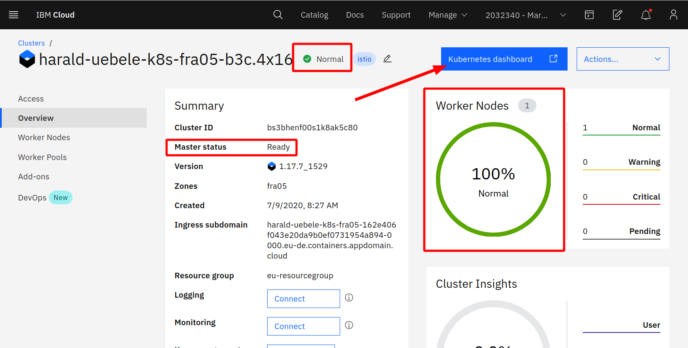

# Exercise 2: Setup your work environment

---

## Check if the cluster is ready

In the IBM Cloud dashboard, in the "Clusters" menu, go to the "Overview" tab:



Status: Normal (and green)
Master status: Ready
Worker Nodes: 100 % Normal

The overview also shows where the cluster was created (in coded form, see [Cloud Data Centers](https://www.ibm.com/cloud/data-centers/) for a map): "hou01" is Houston, Tx. The free clusters are generated whereever spare capacity is available.

Click on "Kubernetes dashboard" and have a look around.

---

## IBM Cloud Shell

You will use the IBM Cloud Shell to continue with the workshop. It is a web based Linux shell that has all the required tools installed and has you already logged into your IBM Cloud account

1. In the menu bar of the IBM Cloud dashboard click on the "terminal" icon:
    

1. Wait a moment for the environment being created:

    

    Read the **Note** about limits and timeouts!

1. The screenshot above shows how to check connection with the IBM Cloud:

    ```
    ibmcloud target
    ```

1. Get the code:

    ```
    git clone https://github.com/Harald-U/istio-handson.git
    cd istio-handson/deployment/
    ```

---

## "Get" the environment

For the rest of the lab we need some parameters that are specific to your environment:

- Cluster name
- IP address of the worker node
- Kube config

1. Execute this command:

    ```
    ./get-env.sh
    ```

    This creates a file local.env, have a look at it:

    ```
    cat local.env
    ```

1. The content of this file is "sourced" in the other script files and you should do that in the Cloud Shell, otherwise you can't use `kubectl` later on:

    ```
    source local.env
    ```

---

## Install Istio

We will use Istio 1.4 and I have written a [blog](https://haralduebele.blog/2019/11/21/installing-istio-1-4-new-version-new-methods/) about installing it.

In this exercise we will use 2 yaml files instead to install Istio into cluster. This is equivalent to a istioctl installation of the demo profile. I have removed the istio-egressgateway (we don't use that) and have modified the telemetry services (used in a later exercise) to use NodePorts.

1. Execute the following command:

    ```
    ./install-istio.sh
    ```

1. Check the status of Istio:

    ```
    kubectl get pod -n istio-system
    ```

    The result should look like this:

    ```
    NAME                                      READY   STATUS    RESTARTS   AGE
    grafana-6c8f45499-t2f8r                   1/1     Running   0          2m19s
    istio-citadel-784d7df6b6-jv89c            1/1     Running   0          2m19s
    istio-galley-7c4f46cb88-qshbs             1/1     Running   0          2m19s
    istio-ingressgateway-79f779dbd-5dqkg      1/1     Running   0          2m18s
    istio-pilot-7dbbc6d47c-b9jr5              1/1     Running   0          2m16s
    istio-policy-76cf7d86c-lthxg              1/1     Running   1          2m15s
    istio-sidecar-injector-74cd6dcd84-qqj8j   1/1     Running   0          2m16s
    istio-telemetry-7b969c885c-jlsq4          1/1     Running   3          2m15s
    istio-tracing-78548677bc-jtk2b            1/1     Running   0          2m15s
    kiali-fb5f485fb-484fg                     1/1     Running   0          2m17s
    prometheus-685585888b-l587g               1/1     Running   0          2m16s
    ```

The `install-istio.sh` script labels the 'default' namespace for [automatic sidecar auto injection](https://istio.io/docs/setup/additional-setup/sidecar-injection/#deploying-an-app).

---

## >> [Continue with Exercise 3](exercise3.md)
