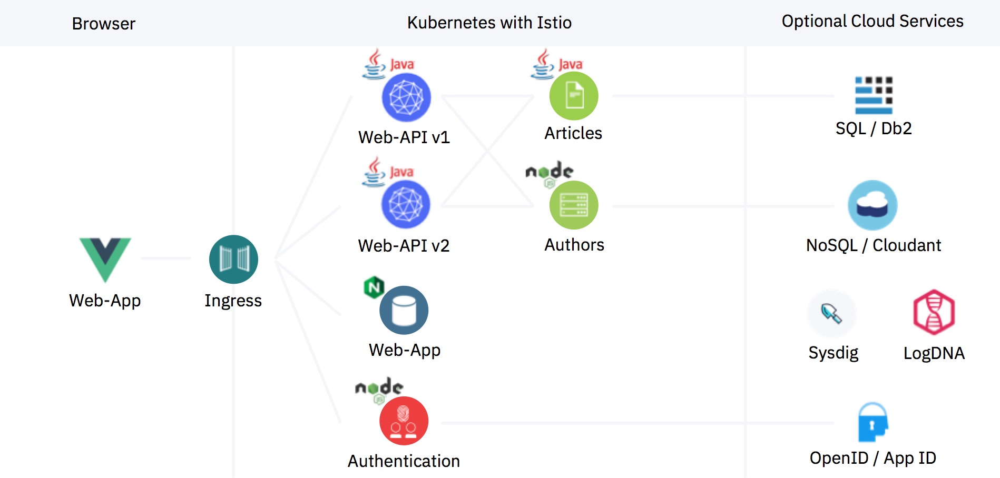
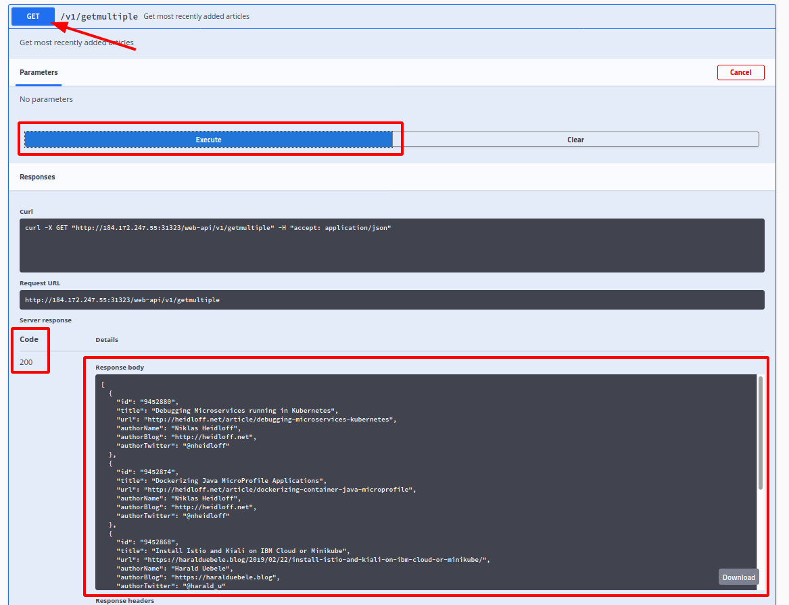
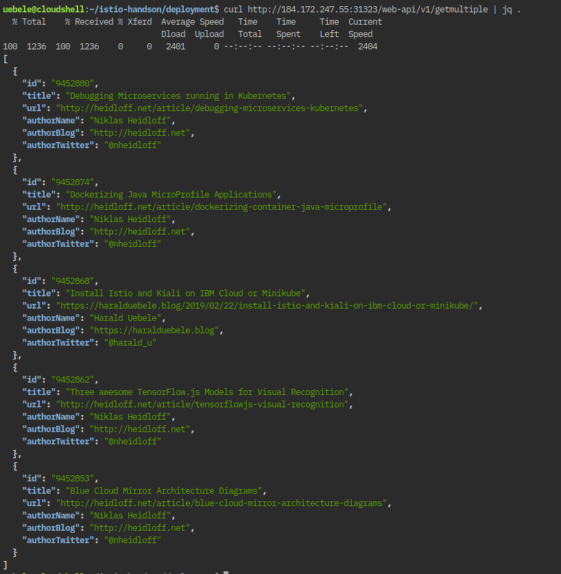

# Exercise 3: Install the Cloud Native Starter sample app

[Cloud Native Starter](https://cloud-native-starter.mybluemix.net/) is a joint project of my colleagues Niklas Heidloff, Thomas Südbröcker, and myself. 

It demonstrates how to develop complete enterprise applications with microservices using Java and MicroProfile and how to operate them with Kubernetes and Istio.

The core components and platforms used in the project are available under open source licenses, it contains a simple sample application that displays and manages blog articles. 



I have created container images for the microservices and placed them on my Docker Hub repository. 

The application itself normally contains a browser based frontend (Web-App), written in Vue.js. It makes REST API calls to the Web-API and therefore needs to be configured with the internet address of the web-api service. The address of course is different for each and every installation. For simplicity we will not use the frontend, instead we will use the API Explorer (Swagger) provided by MicroProfile in the Web-API service.

- Access to the Web-API service is via the Istio Ingress Gateway. 
- Web-API makes a REST request to the articles service to get a list of blog articles.
- For every article received, it makes a REST request to the aAuthors service to get mor details (namely Twitter ID and blog URL).
- There are 2 versions of Web-API:
    - Version 1 (v1) displays 5 articles
    - Version 2 (v2) displays 10 articles
    - Both versions are deployed at the same time

1. Install the Cloud Native Starter:

    ```
    $ ./deploy-app.sh
    ```

    In this example output, the pods are not yet started completely

    ```
    NAME                          READY   STATUS    RESTARTS   AGE
    articles-8488b744cc-xz5jj     1/2     Running   0          2m24s
    authors-7d5cf58b6-h9lcb       2/2     Running   0          2m23s
    web-api-v1-5d85b4d879-wkbdj   1/2     Running   0          2m23s
    web-api-v2-68b648b995-zq6jj   1/2     Running   0          2m23s
    ```

    Each pod must show 2 containers as ready, in this example only true for authors.

    There are two containers in each pod: 1 container is for the service itself, the other is for the Istio sidecar (envoy).

2. Learn how to access the application

    When all pods are ready:

    ```
    $ ./show-urls.sh
    ```

    Sample output:

    ```
    ----------------------------------------------------------------------
    Access the API Explorer for web-api through the Istio Ingress Gateway:
    http://184.172.247.55:31323/openapi/ui in your browser
    In the commandline enter:
    curl http://184.172.247.55:31323/web-api/v1/getmultiple | jq .
    ----------------------------------------------------------------------
    Access Kiali:       http://184.172.247.55:31538
    ----------------------------------------------------------------------
    Access Prometheus:  http://184.172.247.55:30152
    ----------------------------------------------------------------------
    Access Grafana:     http://184.172.247.55:32272
    ----------------------------------------------------------------------
    Access Jaeger:      http://184.172.247.55:30490
    ----------------------------------------------------------------------
    ```

1. Test the application, copy and paste the first URL (e.g. http://184.172.247.55:31323/openapi/ui) in a browser:

    

    - Click the "Get" button for "/v1/getmultiple"
    - Click "Try it out"
    - Click "Execute"


    The Server response should show a code 200 (OK).
    
    The Response body shows a JSON object with either 5 or 10 blog articles.

1. Test the application in the Cloud Shell commandline. Use the output of your run of show-urls.sh!

    ```
    $ curl http://184.172.247.55:31323/web-api/v1/getmultiple | jq .
    ```

    Result:

    

    Five articles are displayed. Which means we were using Web-API v1.

## >> [Continue with Exercise 4](exercise4.md)