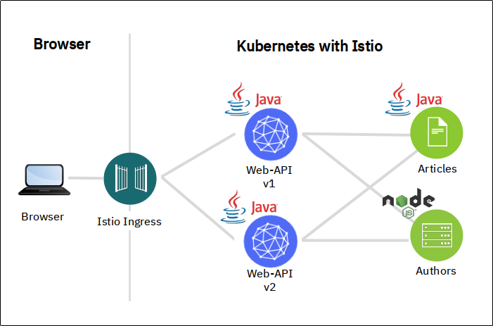

Content:
[Exercise 1: Create your Cloud environment](exercise1.md) ##
[Exercise 2: Setup your work environment](exercise2.md) ##
**Exercise 3: Install the Cloud Native Starter sample app** ##
[Exercise 4: Telemetry](exercise4.md) ##
[Exercise 5: Traffic Management](exercise5.md) ##
[Exercise 6: Secure your services](exercise6.md)

---

# Exercise 3: Install the Cloud Native Starter sample app

---

[Cloud Native Starter](https://cloud-native-starter.mybluemix.net/) is a joint project of my colleagues Niklas Heidloff, Thomas Südbröcker, and myself. 

It demonstrates how to develop complete enterprise applications with microservices using Java and MicroProfile and how to operate them with Kubernetes and Istio.

The core components and platforms used in the project are available under open source licenses, it contains a simple sample application that displays and manages blog articles. 



Since this workshop is about Istio and not about Microservice creation, I have created container images for the microservices and placed them on my Docker Hub repository. This makes them easy and quick to deploy.

The application itself normally contains a browser based frontend (Web-App), written in Vue.js. It makes REST API calls to the Web-API and therefore needs to be configured with the internet address of the web-api service. The address of course is different for each and every installation and it is exposed to the Web-App during the build stage of the Web-App. For simplicity (no build environment) we will not use the frontend, instead we will use the API Explorer (Swagger) provided by MicroProfile in the Web-API service or call the REST API directly with `curl`.

- Access to the Web-API service is via the Istio Ingress Gateway. 
- Web-API makes a REST request to the articles service to get a list of blog articles.
- For every article received, it makes a REST request to the Authors service to get more details (namely Twitter ID and Blog URL).
- There are 2 versions of Web-API:
    - Version 1 (v1) displays 5 articles
    - Version 2 (v2) displays 10 articles
    - Both versions are deployed at the same time

1. Install the Cloud Native Starter:

    ```
    ./deploy-app.sh
    ```
    
    This script simply applys 4 YAML files, one for each microservice (web-api, articles, and authors) and one for the Istio Ingress gateway. They include Kubernetes deployments and services, and Istio VirtualService and DestinationRule definitions.
    
    In this example output, the pods are not yet started completely

    ```
    $ kc get pod
    NAME                          READY   STATUS    RESTARTS   AGE
    articles-8488b744cc-xz5jj     1/2     Running   0          2m24s
    authors-7d5cf58b6-h9lcb       2/2     Running   0          2m23s
    web-api-v1-5d85b4d879-wkbdj   1/2     Running   0          2m23s
    web-api-v2-68b648b995-zq6jj   1/2     Running   0          2m23s
    ```

    Each pod must show 2 containers as ready, in this example only true for authors.

    There are two containers in each pod: 1 container is for the service itself, the other is for the Istio sidecar (envoy).

2. Learn how to access the application

    When all pods are ready:

    ```
    ./show-urls.sh
    ```

    Sample output:

    ```
    -----------------------------------------------------------------------------
    The following URLs work outside the IBM Cloud Shell, too
    -----------------------------------------------------------------------------
    Access the Web-API in a browser:
    API Explorer   http://159.122.181.70:30878/openapi/ui
    REST API       http://159.122.181.70:31469/web-api/v1/getmultiple
    In the commandline:
    curl http://159.122.181.70:31469/web-api/v1/getmultiple | jq .
    'Exercise' in the commandline (endless loop):
    watch -n 1 curl http://159.122.181.70:31469/web-api/v1/getmultiple
    -----------------------------------------------------------------------------
    
    For the different telemetry services issue the 'kubectl port-forward' command
    specified for each service.
    Then do a port preview (eye icon in the uper right corner of Cloud Shell)
    on port 3000.
    
    -----------------------------------------------------------------------------
    Kiali:       kubectl port-forward svc/kiali 3000:20001 -n istio-system
    Login with user: admin and password: admin
    -----------------------------------------------------------------------------
    Prometheus:  kubectl port-forward svc/prometheus 3000:9090 -n istio-system
    -----------------------------------------------------------------------------
    Grafana:     kubectl port-forward svc/grafana 3000:3000 -n istio-system
    -----------------------------------------------------------------------------
    Jaeger:      kubectl port-forward svc/jaeger-query 3000:16686 -n istio-system
    -----------------------------------------------------------------------------
    ```

1. Test the application in a browser using **API Explorer**. Copy and paste the first URL (e.g. http://159.122.181.70:30878/openapi/ui):

    

    - Click the "Get" button for "/v1/getmultiple"
    - Click "Try it out"
    - Click "Execute"


    The Server response should show a code 200 (OK).
    
    The Response body shows a JSON object with either 5 or 10 blog articles.

1. Test the application in a browser by calling the /getmultiple REST API. Copy and paste the second URL (e.g. http://159.122.181.70:30878/web-api/v1/getmultiple):  

    

    The browser in this screenshot formats the JSON nicely. Depending on the browser this may only happen if an add-on or plug-in is installed.


1. Test the application in the **IBM Cloud Shell** commandline. Use the output of your own run of show-urls.sh!

    ```
    curl http://184.172.247.55:31323/web-api/v1/getmultiple | jq .
    ```

    Result ('jq .' does the JSON formatting):

    

    Five articles are displayed. Which means we were using Web-API v1.

---    

## >> [Continue with Exercise 4](exercise4.md)