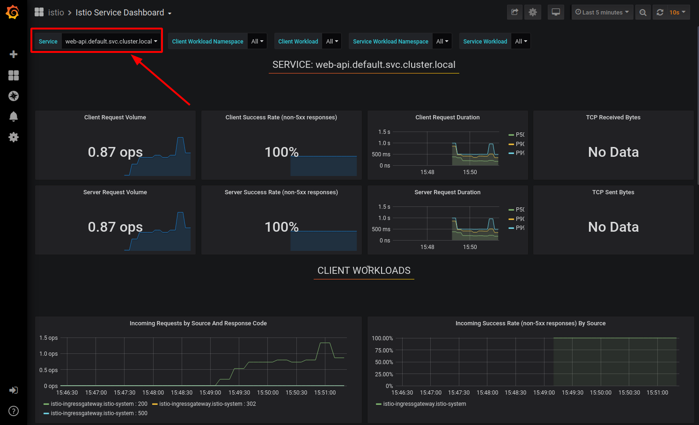
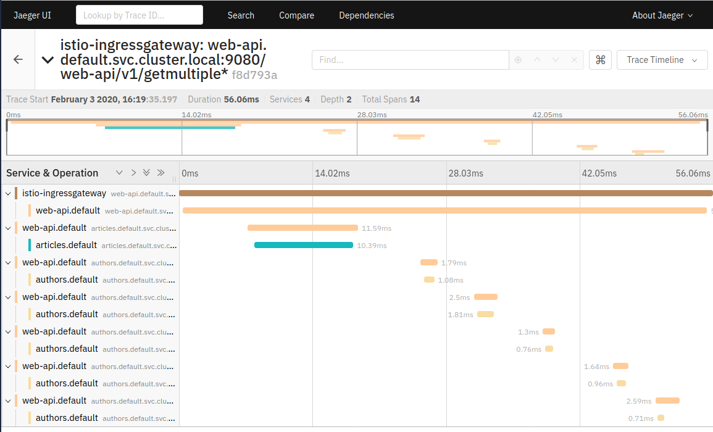

# Exercise 4: Telemetry

### Challenges with microservices

We all know that a microservice architecture is the perfect fit for cloud native applications and it increases the delivery velocities greatly. But envision you have many microservices that are delivered by multiple teams, how do you observe the the overall platform and each of the service to find out exactly what is going on with each of the services?  When something goes wrong, how do you know which service or which communication among the few services are causing the problem?

### Istio telemetry

Istio's tracing and metrics features are designed to provide broad and granular insight into the health of all services. Istio's role as a service mesh makes it the ideal data source for observability information, particularly in a microservices environment. As requests pass through multiple services, identifying performance bottlenecks becomes increasingly difficult using traditional debugging techniques. Distributed tracing provides a holistic view of requests transiting through multiple services, allowing for immediate identification of latency issues. With Istio, distributed tracing comes by default. This will expose latency, retry, and failure information for each hop in a request.

You can read more about how [Istio mixer enables telemetry reporting](https://istio.io/docs/tasks/observability/gateways/#option-2-insecure-access-http).

### Check if Istio is configured to receive telemetry data

Verify that the Grafana, Prometheus, Kiali and Jaeger (jaeger-query) add-ons were installed successfully. All add-ons are installed into the `istio-system` namespace.

    ```shell
    kubectl get pods -n istio-system
    kubectl get services -n istio-system
    ```

In the previous exercise you used the `show-urls.sh` script to display information on how to access the exampke. This included URLs for Kiali, Prometheus, Grafana, and Jaeger.

If neccessary, simply rerun the command:

```
$ ./show-urls.sh
```


## Grafana

Grafana is an open source analytics and monitoring service. 

1. Open the Grafana URL displayed by `show-urls.sh`.

1. Click on Home -> Istio -> Istio Service Dashboard.

1. Execute the getmultiple API of the Web-API service several time, either through the API Explorer or with the curl command as given by `show-urls.sh`.

1. In the Grafana Istio Service Dashboard, select Service "web-api.default.svc.cluster.local" (which is our Web-API service):

    

    You may want to create more load on the API.

This Grafana dashboard provides metrics for each workload. Explore the other dashboard provided as well.

## Prometheus

Prometheus is an open-source systems monitoring and alerting toolkit.

If you want to display application specific metrics, Prometheus needs to be configured. We have an [example](https://github.com/IBM/cloud-native-starter/blob/master/documentation/DemoMetrics.md#demo-metrics) in the Cloud Native Starter repository.

In this demo you will display some Istio metrics (istio_requests_total).

1. Open the Prometheus URL displayed by `show-urls.sh`.

1. In the query field, enter 'istio_requests_total'.

1. Click on 'Execute' and select the 'Graph' tab.


## Jaeger

In a monolithic application, tracing events is rather simple compared to tracing in a microservices architecture. 
What happens when you make a 'getmultiple' REST call to the Web-API service? 
1. The Web-API makes a REST call to the Articles services, requesting 5 or 10 articles.
2. The Articles service returns the data for the articles, including the authors name.
3. The Web-API service then makes a REST call to the Authors service, requesting information about the author.
4. The Authors service returns the Twitter ID and Blog URL for the author. There will be 5 or 10 calls, one for each article.
5. The Web-API service combines this information and sends a JSON object of 5 or 10 articles back to the requestor.

In this simple example we already have 3 services. Imagine an application that is more complex and where the services are scaled into multiple replicas for availability and response times. We need a tool that is able to trace a request through all this distributed invocations. One of these tools is Jaeger and it is installed in our Istio setup. A Jaeger in German is a hunter and they are trained to search traces ...

1. Open the Jaeger URL displayed by `show-urls.sh`.

1. In the Service pulldown, select 'istio-ingressgateway'.

1. Click 'Find Traces'.

   

    In the trace list you can see traces with 10, and traces with 5 requests to the Authors service.

1. Select one of the traces:

    

    You can now see the details about the trace spans as the request is routed through the services.


## Kiali

Kiali is an observability console for Istio with service mesh configuration capabilities. It helps you to understand the structure of your service mesh by inferring the topology, and also provides the health of your mesh. 

1. Open the Kiali URL displayed by `show-urls.sh`.

1. Log in with 'admin/admin'.

1. Open the 'Graph' tab and select the 'default' namespace.

    

This is shows the components of your microservices architecture. Explore the other tabs.

We will use Kiali in the next exercise about Traffic Management.

## >> [Continue with Exercise 5](exercise5.md)

