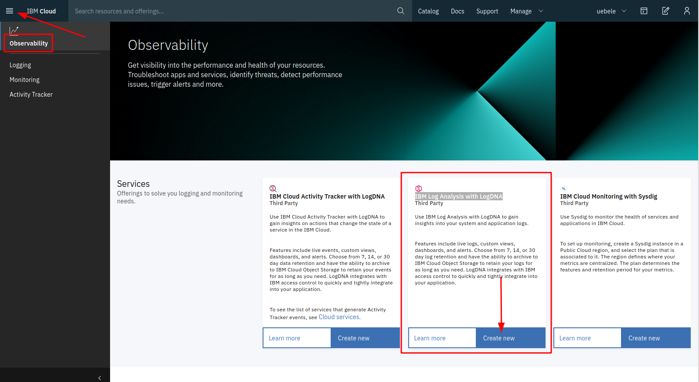
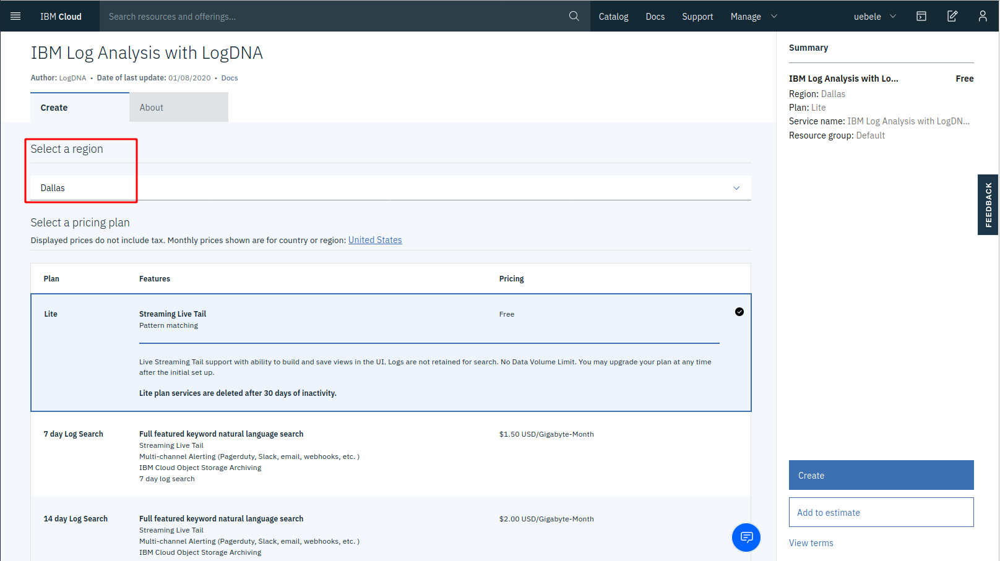
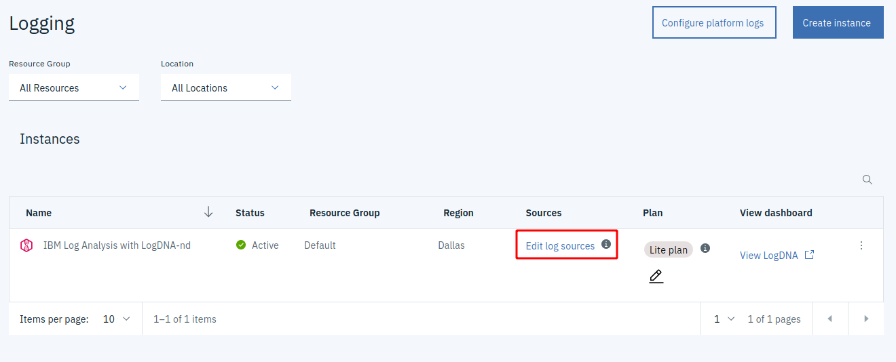
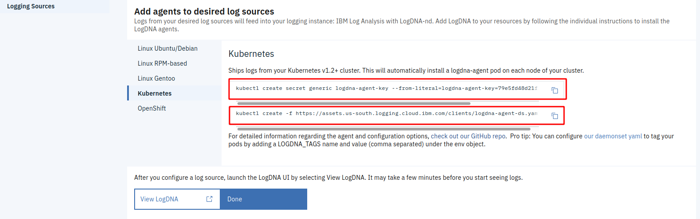
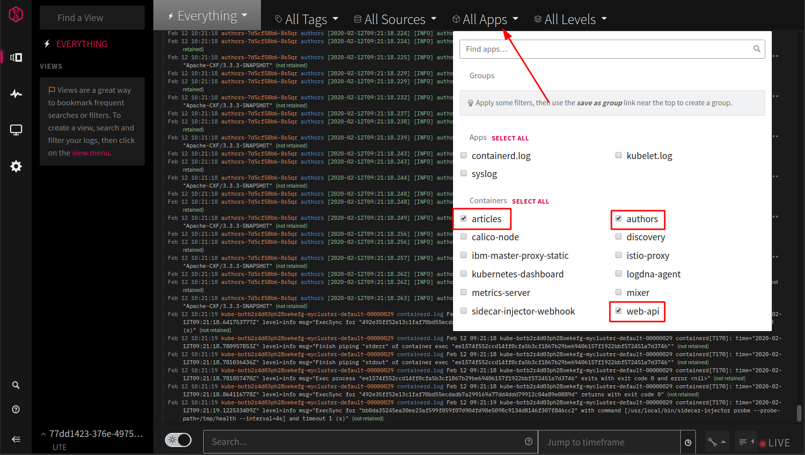
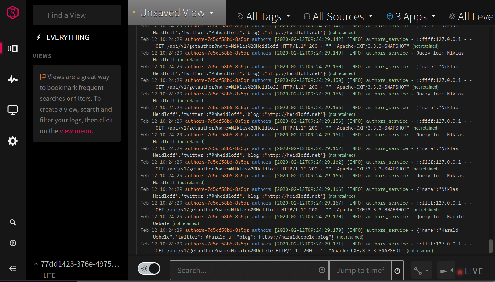

# OPTIONAL
# Exercise 4a: Logging

We all know that logging is important. And with a monolithic application it is fairly easy: one application, one log (very simplistic view, I know). In a microservices architecture this can be a challenge: your application consists of multiple services, each service may be provided by multiple pods/containers for availability and scaling, and pods are ephemeral, in an active cluster, Kubernetes stops and starts pods all the time to spread the load evenly over the worker nodes. Errors may occur in your application and also in the platform itself, in Kubernetes and Istio. Central or Distributed Logging is key, one place where all logging data flows together. 

You can install a logging service into your Kubernetes cluster and you can choose from many Open Source projects (e.g. fluentd). But then you have to manage it yourself, watch storage consumption, etc. In a hosted cloud environment you can use a managed logging service instead. IBM Cloud uses [LogDNA](http://www.logdna.com/) as a third party service. According to Wikipedia, "LogDNA (the product) is a cloud-services-based server-log management and analysis tools that helps developers pinpoint production issues by aggregating all system and application logs into one platform."

[IBM Log Analysis with LogDNA](https://cloud.ibm.com/catalog/services/ibm-log-analysis-with-logdna) is available as a free trial in a so called "lite plan" which supports Live Streaming Tail support with ability to build and save views in the UI but logs are not retained for search (no storage). We will use the free LogDNA lite plan for this exercise.

1. In the IBM Cloud Dashboard, in the burger menu in the upper left corner, select "Observability".

    Click on "Create new" for "IBM Log Analysis with LogDNA":

    


1. Try to select a region for the LogDNA service that is close to your Kubernetes cluster (e.g. my cluster is hosted in Houston so Dallas is close), keep the "Lite" plan selected, and click "Create": 

    

    Note: Creation of the service can take a moment, you may see a "page not found" error first. Wait a moment then refresh the browser. The service will be in status "provisioning" for a few seconds, wait until the status shows "Active".

    

1. Click on "Edit log sources". You will see 2 kubectl commands:

    

    The first command creates a Kubernetes secret, the second command creates a Daemonset.

1. Copy each of the 2 commands into the IBM Cloud Shell and execute them.

1. Check that the Daemonset is started:

    ```
    kubectl get daemonset
    ```

    Result:

    ```
    $ kubectl create secret generic logdna-agent-key --from-literal=logdna-agent-key=xxxxxxxxxxxxxxxxxxxxxxxx
    secret/logdna-agent-key created
    $ kubectl create -f https://assets.us-south.logging.cloud.ibm.com/clients/logdna-agent-ds.yaml                   
    daemonset.apps/logdna-agent created
    $ kubectl get daemonset
    NAME           DESIRED   CURRENT   READY   UP-TO-DATE   AVAILABLE   NODE SELECTOR   AGE
    logdna-agent   1         1         1       1            1           <none>          66s
    ```

 1. "Exercise" the Web-API using the "watch" command from "show-urls.sh"  

 1. Go back to the IBM Cloud Dashboard and "View LogDNA". (Try to use Chrome for this not Firefox, it seems LogDNA works better in Chrome.)

 1. There is a lot of information coming in but you can filter on specific apps:

    

    "articles", "authors", and "web-api" are the 3 services of our Cloud Native Starter.

    


This conludes the optional execise about logging.

---

## >> [Continue with Exercise 5](exercise5.md)