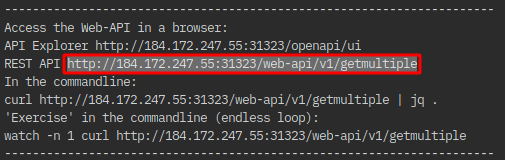

Content:
[Exercise 1: Create your Cloud environment](exercise1.md) ##
[Exercise 2: Setup your work environment](exercise2.md) ##
[Exercise 3: Install the Cloud Native Starter sample app](exercise3.md) ##
[Exercise 4: Telemetry](exercise4.md) ##
**Exercise 5: Traffic Management**

---

# Exercise 5: Traffic Management

---

## Using rules to manage traffic
The core component used for traffic management in Istio is Pilot, which manages and configures all the Envoy proxy instances deployed in a particular Istio service mesh. It lets you specify what rules you want to use to route traffic between Envoy proxies, which run as sidecars to each service in the mesh. Each service consists of any number of instances running on pods, containers, VMs etc. 

Each service can have any number of versions (a.k.a. subsets). There can be distinct subsets of service instances running different variants of the app binary. These variants are not necessarily different API versions. They could be iterative changes to the same service, deployed in different environments (prod, staging, dev, etc.). 

Pilot translates high-level rules into low-level configurations and distributes this config to Envoy instances. Pilot uses three types of configuration resources to manage traffic within its service mesh: 

- Virtual Services
- Destination Rules
- Service Entries

#### Virtual Services
A [VirtualService](https://istio.io/docs/reference/config/networking/virtual-service/) defines a set of traffic routing rules to apply when a host is addressed. Each routing rule defines matching criteria for traffic of a specific protocol. If the traffic is matched, then it is sent to a named [destination](https://istio.io/docs/reference/config/networking/virtual-service/#Destination) service (or [subset](https://istio.io/docs/reference/config/networking/destination-rule/#Subset) or version of it) defined in the service registry.

The VirtualService is applied to the service making the request to another service.

#### Destination Rules
A [DestinationRule](https://istio.io/docs/reference/config/networking/destination-rule/) defines policies that apply to traffic intended for a service after routing has occurred. These rules specify configuration for load balancing, connection pool size from the sidecar, and outlier detection settings to detect and evict unhealthy hosts from the load balancing pool. Any destination `host` and `subset` referenced in a `VirtualService` rule must be defined in a corresponding `DestinationRule`.

The DestinationRule is applied to the service receiving requests via a VirtualService. You always need both, VirtualService and DestinationRule, for Istio Traffic Management to work.

#### Service Entries
A [ServiceEntry](https://istio.io/docs/reference/config/networking/service-entry/) configuration enables services within the mesh to access a service not necessarily managed by Istio. The rule describes the endpoints, ports and protocols of a white-listed set of mesh-external domains and IP blocks that services in the mesh are allowed to access. This could be services outside Kubernetes, e.g. on another Cloud.

**Note:** In our Cloud Native Starter example, the Virtual Services and Destination Rules were configured during the initial deployment of the services.

---

## The Cloud Native Starter app

Our Cloud Native Starter app has three services:

- 2 versions of Web-API
- Articles
- Authors


You just learned in the introduction of this exercise that traffic routing rules are defined with a Virtual Service. The Virtual Service belongs to the pod that makes the call. E.g. traffic routing rules for the Authors service would be defined in a Virtual Service for Web-API because the call to Authors is made by Web-API.

We have two versions of Web-API and we want to do traffic management on these. But there is no service in front of Web-API that could hold the Virtual Service! Wrong! The Istio Ingress Gateway acts as a sidecar/envoy and can be used to configure a Virtual Service. You can find the configuration in file `istio-ingress.yaml`.

You have also learned in the introduction of this exercise that a Destination Rule is required together with the Virtual Service. The Destination Rule for Web-API is defined in file `web-api.yaml`:

```
apiVersion: networking.istio.io/v1alpha3
kind: DestinationRule
metadata:
  name: web-api
spec:
  host: web-api
  subsets:
  - name: v1
    labels:
      version: v1
  - name: v2
    labels:
      version: v2
```

This rule defines two subsets: v1 and v2.

Open the URL of the 'getmultiple' API printed by `show-urls.sh` directly in your browser:



Also open the Kiali dashboard, the URL is also printed by `show-urls.sh`, and open the 'Graph' view of the 'default' namespace.

Refresh your browser mutliple times. Its hard to see but you will get v1 = 5 articles or v2 = 10 articles in a 50/50 distribution.


(Kiali will show 50/50 if you refresh long enough.)

The current VirtualService applied to the Istio Ingress Gateway doesn't do any traffic management, it directly routes the 'real' Web-API service (port: 9080):

```
  - match:
    - uri:
        prefix: /web-api/v1/getmultiple 
    route:
    - destination:
        port:
          number: 9080
        host: web-api
```

---

## A/B Testing with Istio

In the Cloud Shell switch to another directory:

```
cd ../istio
```

We will now apply a configuration that only calls v1 of Web-API by using the subset v1:

```
  - match:
    - uri:
        prefix: /web-api/v1/getmultiple 
    route:
    - destination:
        host: web-api
        subset: v1
```        

To do this execute (in the istio directory):

```
kubectl apply -f web-api-v1-only.yaml
```

"Exercise" the getmultiple API in your browser and watch the results in Kiali, too. You will only see v1 = 5 articles is being used.

The next rule routes based on header information, you need Firefox and Chrome browser to test this:

```
  - match:
    - headers:
        user-agent:
          regex: '.*Firefox.*'
      uri:
        prefix: /web-api/v1/getmultiple  
    route:
    - destination:
        host: web-api
        subset: v2    
  - match:
    - uri:
        prefix: /web-api/v1/getmultiple  
    route:
    - destination:
        host: web-api
        subset: v1
```

You see two matching rules:

1. IF user-agent is Firefox AND /web-api/v1/getmultiple is the URI THEN use v2
2. IF web-api/v1/getmultiple is the URI (and nothing else) THEN use v1

Two important things to note:

- In the first match the conditions are **AND**ed because there is no '-' in front of 'uri:'
- This only works due to the order of the matches! The matches are tested in sequence and the first 'hit' determines the route.

Test it yourself:

```
kubectl apply -f web-api-v2-firefox.yaml
```

Now open the getmultiple URL (`show-urls.sh`) both in Firefox and Chrome and exercise it. You should see 10 articles in Firefox (v2) and 5 articles in Chrome (v1).

---

## Canary Deployments

In 'Canary Deployments', newer versions of services are incrementally rolled out to users to minimize the risk and impact of any bugs introduced by the newer version. To begin incrementally routing traffic to the newer version of the guestbook service, another VirtualService rule is used:

```
  - match:
    - uri:
        prefix: /web-api/v1/getmultiple 
    route:
      - destination:
          host: web-api
          subset: v1
        weight: 80
      - destination:
          host: web-api
          subset: v2
        weight: 20 
```

In the modified rule, the routed traffic is split between two different subsets of the Web-API service. In this manner, traffic to the "modernized" version 2 of Web-API is controlled on a percentage basis (20% of all requests) to limit the impact of any unforeseen bugs. This rule can be modified over time until eventually all traffic is directed to the newer version of the service.

Exercise the API, e.g. like this in Cloud Shell, replace with your IP address and port:

```
watch -n 1 curl http://184.172.247.55:31323/web-api/v1/getmultiple
```

And inspect the results in Kiali:


---

## Fault Injection

Istio allows to inject faults to test the resiliency of your application. Resiliency is part of the Cloud Native Starter and you can read about it [here](http://heidloff.net/article/resiliency-microservice-microprofile-java-istio).

Again a VirtualService definition is used, this time for the Authors service:

```
apiVersion: networking.istio.io/v1alpha3
kind: VirtualService
metadata:
  name: authors
spec:
  hosts:
  - authors
  http:
  - route:
    - destination:
        host: authors
        subset: v1
    fault:
      abort:
        httpStatus: 500
        percent: 50
```

It terminates 50% of all requests to the Authors service with an HTTP 500 status message.

Apply the rule:

```
kubectl apply -f fault-authors-500-50per.yaml
```

Exercise the /getmultiple API in the API Explorer (`show-urls.sh`) and watch der results in Kiali.

In the API Explorer in the Server Response body, look at authorBlog and authorTwitter:


In the 1st and 3rd entry, both parameters are empty, in the 2nd entry they are not. In Kiali you can see the error situation, too:


Restore "order" with:

```
kubectl apply -f nofault-authors.yaml
```

---

## Other Istio Options

[Istio documentation](https://istio.io/docs/tasks/traffic-management/fault-injection/) on Traffic Management has even more options:

- Request Timeouts
- Circuit Breaking 
- Mirroring

---

## Congratulation!

You have completed this workshop!