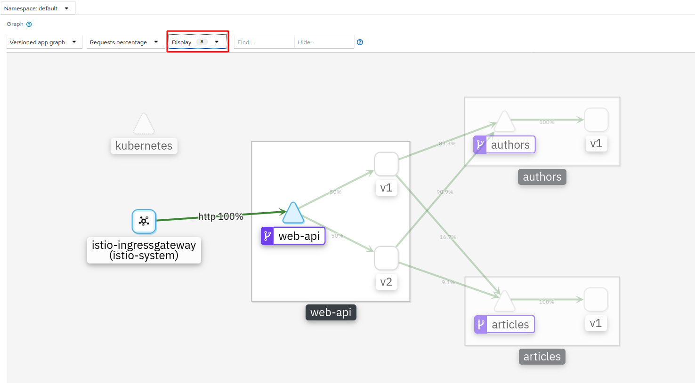
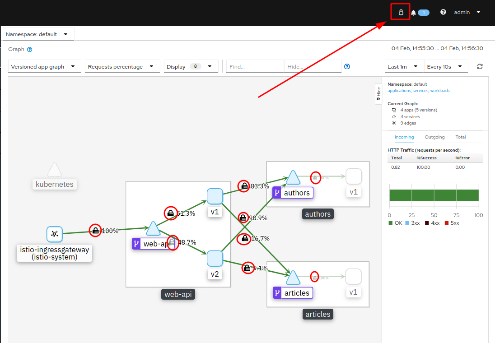

# Exercise 6: Secure your services

## Mutual authentication with Transport Layer Security (mTLS)

Istio can secure the communication between microservices without requiring application code changes. Security is provided by authenticating and encrypting communication paths within the cluster. This is becoming a common security and compliance requirement. Delegating communication security to Istio (as opposed to implementing TLS in each microservice), ensures that your application will be deployed with consistent and manageable security policies.

Istio Citadel is an optional part of Istio's control plane components. When enabled, it provides each Envoy sidecar proxy with a strong (cryptographic) identity, in the form of a certificate.
Identity is based on the microservice's service account and is independent of its specific network location, such as cluster or current IP address.
Envoys then use the certificates to identify each other and establish an authenticated and encrypted communication channel between them.

Citadel is responsible for:

* Providing each service with an identity representing its role.

* Providing a common trust root to allow Envoys to validate and authenticate each other.

* Providing a key management system, automating generation, distribution, and rotation of certificates and keys.

When an application microservice connects to another microservice, the communication is redirected through the client side and server side Envoys. The end-to-end communication path is:

* Local TCP connection (i.e., `localhost`, not reaching the "wire") between the application and Envoy (client- and server-side);

* Mutually authenticated and encrypted connection between Envoy proxies.

When Envoy proxies establish a connection, they exchange and validate certificates to confirm that each is indeed connected to a valid and expected peer. The established identities can later be used as basis for policy checks (e.g., access authorization).

## Enforce mTLS between all Istio services

1. Ensure Citadel is running

    Citadel is Istio's in-cluster Certificate Authority (CA) and is required for generating and managing cryptographic identities in the cluster.
    Verify Citadel is running:

    ```shell
    kubectl get deployment -l istio=citadel -n istio-system
    ```

    Expected output:

    ```shell
    NAME            READY   UP-TO-DATE   AVAILABLE   AGE
    istio-citadel   1/1     1            1           23h
    ```

2. Define mTLS Authentication Policy

   Exercise the /getmultiple API and look in the Kiali dashboard, in the 'Graph' tab. In the 'Display' pulldown, enable 'Security'.

   

   There is nothing new to see, it is for comparison.

   Next, we create a `MeshPolicy` for configuring the receiving end to use mTLS. The following destination rules will then configure the client side to use mTLS. We'll update the previously created destination rules to include mTLS. 
   
   ```
   apiVersion: "authentication.istio.io/v1alpha1"
    kind: "MeshPolicy"
    metadata:
    name: "default"
    spec:
    peers:
    - mtls: {}
    ---
    apiVersion: networking.istio.io/v1alpha3
    kind: DestinationRule
    metadata:
    name: articles
    spec:
    host: articles
    subsets:
    - name: v1
        labels:
        version: v1
    trafficPolicy:
        tls:
        mode: ISTIO_MUTUAL
    ---
    apiVersion: networking.istio.io/v1alpha3
    kind: DestinationRule
    metadata:
    name: authors
    spec:
    host: authors
    subsets:
    - name: v1
        labels:
        version: v1
    trafficPolicy:
        tls:
        mode: ISTIO_MUTUAL
    ---
    apiVersion: networking.istio.io/v1alpha3
    kind: DestinationRule
    metadata:
    name: web-api
    spec:
    host: web-api
    subsets:
    - name: v1
        labels:
        version: v1
    - name: v2
        labels:
        version: v2
    trafficPolicy:
        tls:
        mode: ISTIO_MUTUAL
    ```

   Run the following command to enable mTLS across your cluster:

   ```
   kubectl apply -f mtls.yaml
   ```

   Again, exercise the /getmultiple API and look in the Kiali dashboard:

   

   Notice the padlocks on every connection, this indicates that the connection is secured. Also notice the padlock in the title bar. When you hover over it, it says "Mesh-wide TLS is partially enabled".

   ```
   kubectl get meshpolicies
   ```

   will show:

   ```
   NAME      AGE
   default   17m
   ```
## Control Access to the Analyzer Service

Istio support Role Based Access Control(RBAC) for HTTP services in the service mesh.  Let's leverage this to configure access between Web-API and Authors services.

1. Create service accounts for the Web-API and Authors services.

    ```
    kubectl create sa web-api
    kubectl create sa authors
    ```

2. Modify Web-API and Authors deployments to use leverage the service accounts.

  * Navigate to your guestbook dir first, for example:
    ```shell
    cd ../guestbook
    ```

  * Redeploy the Web-API and Authors deployments with added service account  definitions:

    ```
    kubectl apply -f authors-sa.yaml
    kubectl apply -f web-api-sa.yaml
    ```

3. Create a `AuthorizationPolicy` to disable all access to analyzer service.  This will effectively not allow guestbook or any services to access it.

    ```shell
    cat <<EOF | kubectl create -f -
    apiVersion: security.istio.io/v1beta1
    kind: AuthorizationPolicy
    metadata:
      name: analyzeraccess
    spec:
      selector:
        matchLabels:
          app: analyzer
    EOF
    ```

    Output:

    ```shell
    authorizationpolicy.security.istio.io/analyzeraccess created
    ```
    
4.  Visit the Guestbook app from your favorite browser and validate that Guestbook v2 does not run correctly by entering some message into the guestbook. For every new message you write on the Guestbook v2 app, you will get a message such as "Error - unable to detect Tone from the Analyzer service".  It can take up to 15 seconds for the change to propogate to the envoy sidecar(s) so you may not see the error right away.

5. Configure the Analyzer service to only allow access from the Guestbook service using the added `rules` section:

    ```
    cat <<EOF | kubectl apply -f -
    apiVersion: security.istio.io/v1beta1
    kind: AuthorizationPolicy
    metadata:
      name: analyzeraccess
    spec:
      selector:
        matchLabels:
          app: analyzer
      rules:
      - from:
        - source:
            principals: ["cluster.local/ns/default/sa/guestbook"]
        to:
        - operation:
            methods: ["POST"]
    EOF
    ```

6.  Visit the Guestbook app from your favorite browser and validate that Guestbook V2 works now.  It can take a few seconds for the change to propogate to the envoy sidecar(s) so you may not observe Guestbook V2 to function right away.


