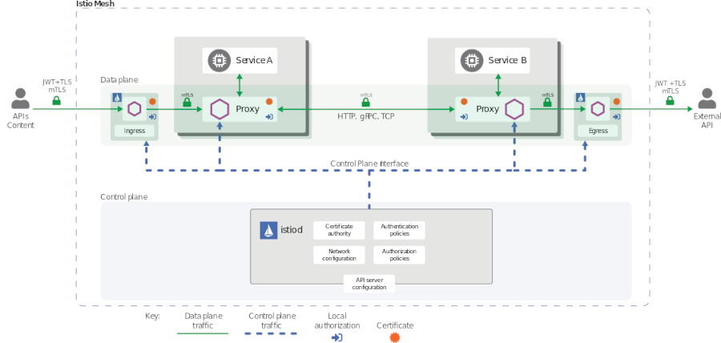
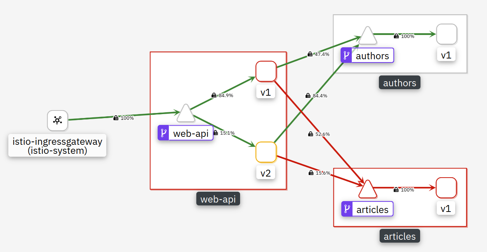
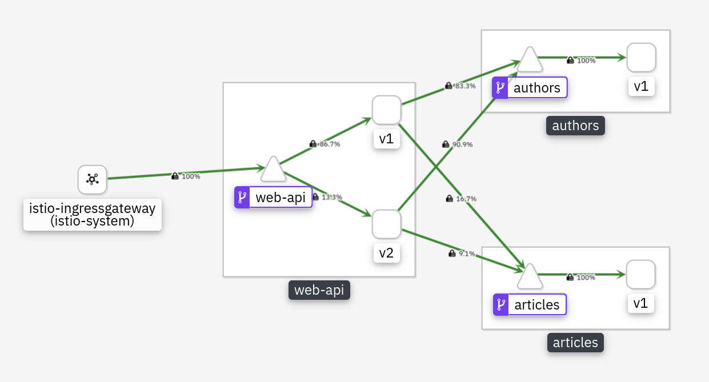

# Exercise 6: Secure your services 

## Mutual authentication with Transport Layer Security (mTLS)

Istio can secure the communication between microservices without requiring application code changes. Security is provided by authenticating and encrypting communication paths within the cluster. This is becoming a common security and compliance requirement. Delegating communication security to Istio (as opposed to implementing TLS in each microservice) ensures that your application will be deployed with consistent and manageable security policies.

This exercise will cover only a part of the Istio security features. The [Istio documentation](https://istio.io/latest/docs/concepts/security/) has a lot more information.

Istio provides each Envoy sidecar proxy with a strong (cryptographic) identity, in the form of a certificate. This identity is based on the microservice's service account and is independent of its specific network location, such as cluster or current IP address. This is called [Secure naming](https://istio.io/latest/docs/concepts/security/#secure-naming).
Envoys then use the certificates to identify each other and establish an authenticated and encrypted communication channel between them.

So what is this "mTLS"? 

When you access a web site in your browser using 'https://' you are using TLS. Your browser is able to verify the authenticity of the web site you are visiting by validating the TLS certificate that the web site presents. 

In addition to that, mutual TLS (mTLS) enables a server to verify a client's identity because the client needs to present its own certificate to the server, too. This is often used in corporate networks to secure access to the WiFi network or in VPN connections. The client can validate that it connects to the right server and the server can verify the clients identity. This eliminates the possibility of "man in the middle" attacks.

Istio is responsible for:

* Providing each service with an identity representing its role.

* Providing a common trust root to allow Envoys to validate and authenticate each other.

* Providing a key management system, automating generation, distribution, and rotation of certificates and keys.



When an application microservice connects to another microservice, the communication is redirected through the client side and server side Envoys. The end-to-end communication path is:

* Local TCP connection (i.e., `localhost`, not reaching the "wire") between the application and Envoy (client- and server-side);

* Mutually authenticated and encrypted connection between Envoy proxies.

This includes the Istio Ingress for incoming and the Istio Egress for outgoing connections. Your Kubernetes cluster may/will have its own ingress but this ingress is not paired with an Envoy sidecar and therefore is not able to directly participate in secure and encrypted communications.

When Envoy proxies establish a connection, they exchange and validate certificates to confirm that each is indeed connected to a valid and expected peer. The established identities can later be used as basis for policy checks (e.g., access authorization).

mTLS is enabled by default for the communication between Envoys but it is enabled in **permissive mode**. This means that a microservice outside of the Istio Service Mesh, one without a Envoy proxy, can communicate with a microservice within the Service Mesh. This allows you to bring your microservices into the Service Mesh and then gradually turn on and test security. We will do this in the remainder of this exercise.

## Enforce mTLS between all Istio services

1. Open Kiali, select 'Graph', Namespace: default, and in the Display pulldown check 'Security'. The display will change a little bit and show little phone handsets: 
    

    *I am currently not sure if this is on purpose or a bug because I don't understand the meaning of a handset in a security context. In previous versions there was a padlock icon when mTLS was set to STRICT.*

1. Next we create a PeerAuthentication configuration for configuring the receiving end to use mTLS. We also change the existing destination rules to configure the client side to use mTLS.

    Run the following command to enable mTLS in the 'default' namespace:

    ```
    kubectl apply -f mtls.yaml
    ```
    
<!--1. Check Kiali again: 

    - In the Titlebar in the upper right corner you'll see a padlock. When you hover with your mouse pointer over it, it will say "Mesh-wide TLS is enabled". This is the result of the PeerAuthentication configuration.
    - You will also see padlocks on all connections, the result of the modified DestinationRules

**Note:** If you restart the Articles or the Web-API service now, they may not come up again. Kubernetes Dashboard would show that the Readiness Probe failed. The reason for this is:

>> "If your health check is on the same port as your main application's serving port, and you have Istio Auth enabled (i.e. you have mTLS enabled between services in your mesh) then health checking will not work. This is because Envoy can't tell the difference between a health check and regular old un-encrypted traffic, and the API server performing health checking doesn't run with a sidecar that can perform mTLS for it."

This is the case in our example for the Articles and Web-API service: the liveness/readiness probes are on the same port as the service API itself. If the Kubernetes API server probes fail, then the pods will begin to fail. This problem can be avoided by using the `sidecar.istio.io/rewriteAppHTTPProbers: "true"` pod annotation. This annotation enables the rewrite of the HTTP probes without requiring changes to the services. Actually it seems that this is the default for Istio, now.-->

## Control Access to the Articles Service

Istio supports Role Based Access Control (RBAC) for HTTP services in the service mesh. Let's leverage this to configure access between Web-API and Articles services.

1. Create service accounts for the Articles and Web-API services:

    ```
    kubectl create sa articles
    kubectl create sa web-api
    ```

1. Replace the deployment of Articles and Web-API, this adds the service accounts to the deloyment:

    ```
    kubectl replace -f articles-sa.yaml
    kubectl replace -f web-api-sa.yaml
    ```

    The Articles microservice now runs under service account 'articles', the Web-API service uses the 'web-api' service account.

1. Apply an AuthorizationPolicy:

    ```
    kubectl apply -f authorization.yaml
    ```

    The policy looks like this:

    ```
    apiVersion: security.istio.io/v1beta1
    kind: AuthorizationPolicy
    metadata:
    name: articlesaccess
    spec:
    selector:
        matchLabels:
        app: articles
    ```

    If you check the application in Kiali you will see errors, but this may take several minutes:

     

    Reason: This AuthorizationPolicy effectively disables all access to Articles.  

1. Now allow access to the Articles service from Web-API:

    ```
    kubectl apply -f authorization-w-rule.yaml
    ```

    The modified policy looks like this:

    ```
    apiVersion: security.istio.io/v1beta1
    kind: AuthorizationPolicy
    metadata:
    name: articlesaccess
    spec:
    selector:
        matchLabels:
        app: articles
    rules:
    - from:
        - source:
            principals: ["cluster.local/ns/default/sa/web-api"]
        to:
        - operation:
            methods: ["GET", "POST"]    
    ```

    This allows 'GET' and 'POST' operations on the 'articles' microservice for the ServiceAccount (sa) web-api which is assigned to the Web-API service in the default namespace.

    You need to wait a while (several minutes) to see the results in Kiali but eventually everything will be 'green' again:

    

## Expose the Istio Ingress gateway via DNS (without TLS)

The following procedures are platform specific and work with a "standard classic" Kubernetes Cluster provided by the IBM Cloud Kubernetes Service (IKS) on the IBM Cloud. If you are using a VPC based or a free ("Lite") Kubernetes Cluster on the IBM Cloud or another Cloud provider or something like Minikube, the following sections will **not** work! 

When we install Istio on our pre-provisioned Kubernetes Clusters on IBM Cloud, the Istio Ingress is created with a Kubernetes service of type LoadBalancer and is assigned a "floating" IP address through which it can be reached via the public Internet. You can determine this address with the following command:

```
kubectl get svc -n istio-system | grep istio-ingressgateway
```

The output should look like this:

```
istio-ingressgateway   LoadBalancer  172.21.213.52  149.***.131.***   15020:31754/TCP,...
```

Our Ingress gateway is in fact of type LoadBalancer, the second IP address is the external (public) IP address. In exercise 2 we already obtained this address and stored it in the $INGRESSIP environment variable. The `show-urls.sh` script is using this address to print the URLs to access the Web-API. 

To create a DNS subdomain, a URL, for the Ingress gateway (= loadbalancer, nlb) use the following command:

```
ibmcloud ks nlb-dns create classic --cluster $MYCLUSTER --ip $INGRESSIP
```

The output should look like this:

```
OK
NLB hostname was created as harald-uebele-k8s-fra05-********************-0001.eu-de.containers.appdomain.cloud
```

The new subdomain will have the form `[cluster name]-[globally unique hash]-[region]-containers.appdomain.cloud`.


Save this name in another environment variable, e.g.:

```
INGRESSURL=harald-uebele-k8s-fra05-********************-0001.eu-de.containers.appdomain.cloud
```

and test it:

```
curl http://$INGRESSURL/web-api/v1/getmultiple | jq .
```

This should display a list of blog articles in JSON format.


## Expose the Istio Ingress gateway via DNS with TLS enabled

In the last section we have created a DNS entry for the Ingress controller. But access to our resources was using unsecure HTTP on port 80. In this section we enable secure HTTPS access on port 443.

The procedure we will use in this section is documented [here](https://cloud.ibm.com/docs/containers?topic=containers-istio-mesh#istio_expose_bookinfo_tls).

There is also generic documentation about [Secure Gateways](https://istio.io/latest/docs/tasks/traffic-management/ingress/secure-ingress/) available in the Istio documentation.

The Istio Ingress gateway on the IBM Cloud is of type LoadBalancer and in the last section we created a DNS subdomain for it. This also automatically generates a Let's Encrypt certificate for HTTPS/TLS traffic and creates a Kubernetes secret containing this certificate. We need to pull the certificate from this secret, change its name, and create a new secret so that the Istio Ingress gateway can use it. 

List the DNS subdomains:

```
ibmcloud ks nlb-dns ls --cluster $MYCLUSTER
```

You should see 2 entries, the first is for the Kubernetes Ingress that is created for you when the cluster is created.

The second is the Istio Ingress subdomain you created in the last section. Copy the "SSL Cert Secret Name" (should end on -0001) and paste it into another environment variable:

```
INGRESSSECRET=harald-uebele-k8s-fra05-********************-0001
```

Pull the secret and save it into a file 'mysecret.yaml':

```
kubectl get secret $INGRESSSECRET --namespace default --export -o yaml > mysecret.yaml
```

Open the mysecret.yaml file in an editor (nano, vim), change the value of `name:` from the secret name to `istio-ingressgateway-certs` and save the file. It should look similar to this example:

```
apiVersion: v1
data:
  tls.crt: LS0tLS1CRUdJTiBDRVJUSUZJQ0FURS0tLS0tCk...
  tls.key: LS0tLS1CRUdJTiBSU0EgUFJJVkFURSBLRVktLS...
kind: Secret
metadata:
  annotations:
    ingress.cloud.ibm.com/cert-source: ibm
    kubectl.kubernetes.io/last-applied-configuration: |
      {"apiVersion":"v1","data":{"tls.crt":"LS0tLS1CRUdJTiBDRVJUSUZJQ0FU...
  creationTimestamp: null
  name: istio-ingressgateway-certs
  selfLink: /api/v1/namespaces/default/secrets/harald-uebele-k8s-***************-0001
type: Opaque
```

Then load and activate the secret with these commands:

```
kubectl apply -f ./mysecret.yaml -n istio-system
kubectl delete pod -n istio-system -l istio=ingressgateway
kubectl delete gateway default-gateway-ingress
```

The last command deletes the gateway definition for the Istio Ingress. It was defined for HTTP on port 80 and used a wildcard host name "*". With TLS we need to change the port to 443 and specify the correct host that must match the host in the Let's Encrypt TLS certificate.

Edit the file `istio-ingress-tls.yaml` in the istio directory. Replace the 2 occurances of wildcard "*", one in the Gateway, one in the VirtualService definition:

```
hosts:
- "*"
```

with the $INGRESSURL you obtained in the last section:

```
hosts:
- "harald-uebele-k8s-fra05-**********-0001.eu-de.containers.appdomain.cloud"
```

Watch out for the correct indents, this is YAML!

Apply the change with:

```
kubectl apply -f istio-ingress-tls.yaml
```

Test with:

```
curl -i https://$INGRESSURL/web-api/v1/getmultiple
```

Note: This last step, replacing the wildcard host "*" with the correct DNS name, is not really necessary. But now you have a correct configuration.

There is a blog on the Istio page that describes how to [Direct encrypted traffic from IBM Cloud Kubernetes Service Ingress to Istio Ingress Gateway](https://istio.io/latest/blog/2020/alb-ingress-gateway-iks/). With this scenario you can have non-Istio secured services communicate with services secured by Istio, e.g. while you are migrating your application into Istio.

This blog contains an important piece of information regarding the Let's Encrypt certificates used:

> The certificates provided by IKS expire every 90 days and are automatically renewed by IKS 37 days before they expire. You will have to recreate the secrets by rerunning the instructions of this section every time the secrets provided by IKS are updated. You may want to use scripts or operators to automate this and keep the secrets in sync.


---

## Congratulations!

You have completed this workshop!    
